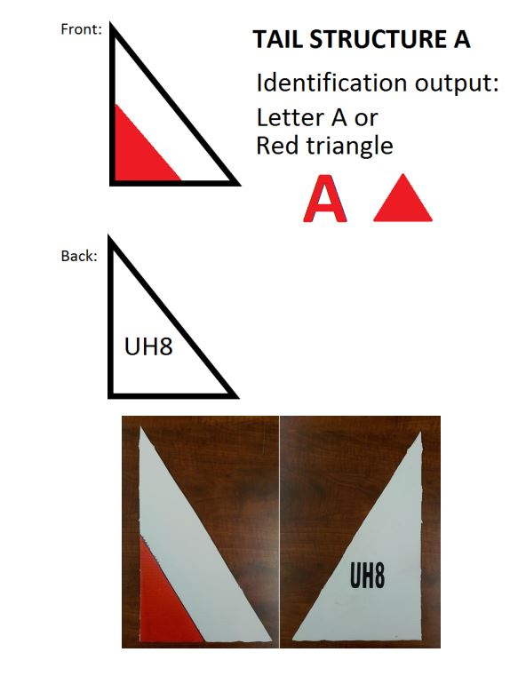

# OpenCV based Aircraft Tailshape and Code Recognition
These are 2 Python applications using OpenCV and Tesseract OCR libraries to solve one of MATE ROV Competition 2018 Explorer Class tasks which is about identifying 6 different colored shapes of different aircrafts and recognize the text written on its back, in order to define the class of that aircraft.

Aircraft Identification Handbook from MATE (Copy attached)

